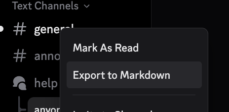
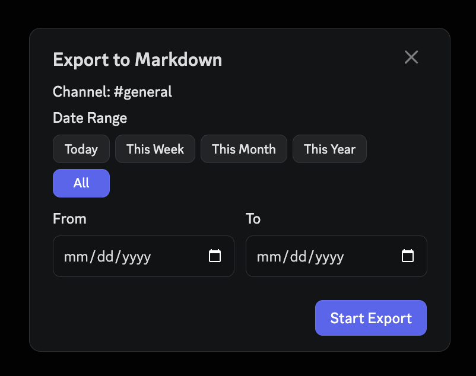

# ExportToMarkdown

Vencord plugin to export full Discord channel chat history to a Markdown file.

<p align="center">
  
  &nbsp;&nbsp;&nbsp;
  
</p>

## Install

```sh
curl -sSL https://raw.githubusercontent.com/miwgel/VencordExportToMarkdown/main/install.sh | bash
```

This handles everything: clones Vencord source (if needed), installs the plugin, builds, and injects into Discord. Just restart Discord after.

**Already have a Vencord source tree?** Clone directly:

```sh
git clone https://github.com/miwgel/VencordExportToMarkdown.git path/to/Vencord/src/userplugins/exportToMarkdown
```

Then `pnpm build` and restart Discord.

## Usage

Right-click any channel → **Export to Markdown** → wait for progress → Download.

## Features

- Exports full channel history (not just loaded messages) via paginated API fetching
- Progress modal with cancel support
- Handles all message types: regular messages, replies, embeds, attachments, reactions, pins, edit history, system messages
- Works with server channels, DMs, group DMs, and threads
- Configurable settings for what content to include
- Rate limit handling with automatic retry
- No API key needed — uses your active Discord session

## Settings

| Setting | Default | Description |
|---|---|---|
| Include Embeds | On | Include embed content (titles, descriptions, fields, images) |
| Include Reactions | On | Show reaction emoji and counts |
| Include Attachments | On | List attachment URLs with file info |
| Include Edit History | On | Show edit history (requires MessageLogger) |
| Include Pin Indicator | On | Mark pinned messages |
| Include System Messages | On | Include join/boost/pin notifications |
| Batch Delay | 600ms | Delay between API requests (lower = faster, higher = safer) |

## License

MIT
